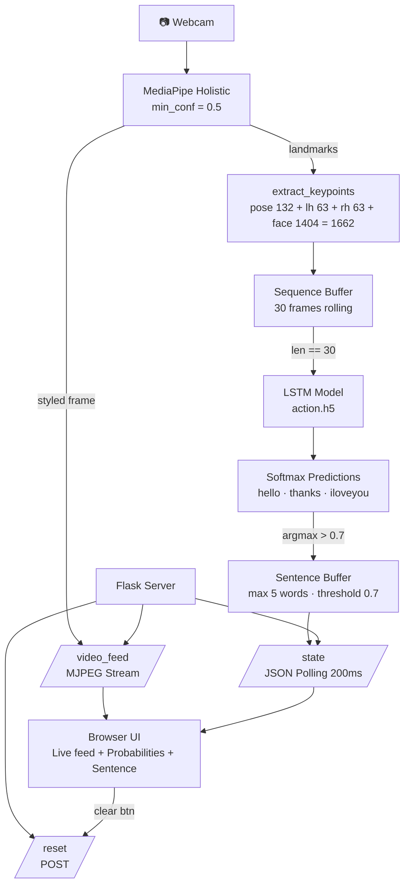
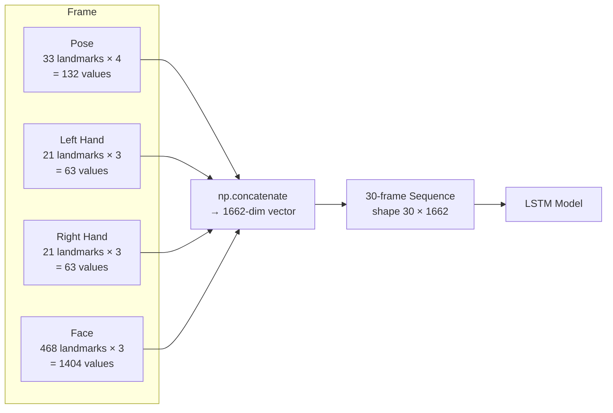
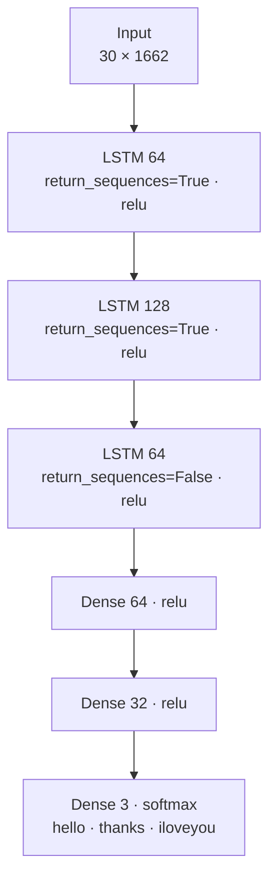

# SignSense: Real-Time Sign Language Detection Web App

Flask web interface for your MediaPipe + LSTM sign language detection project.

---

## System Architecture



---

## Data Flow — Keypoint Extraction



---

## LSTM Model Architecture



---

## Setup

```bash
pip install -r requirements.txt
```

Place your trained model file (`action.h5`) in the project root.

## Run

```bash
python app.py
```

Open `http://127.0.0.1:5000` in your browser.

---

## Project Structure

```
sign_language_app/
├── app.py               # Flask backend + video stream + prediction logic
├── requirements.txt
├── action.h5            # ← put your trained model here
└── templates/
    └── index.html       # Dark neural UI
```

---

## API Endpoints

| Route | Method | Description |
|-------|--------|-------------|
| `/` | GET | Main UI |
| `/video_feed` | GET | MJPEG stream with landmarks |
| `/state` | GET | JSON — predictions, sentence, FPS, confidence |
| `/reset` | POST | Clears sentence + sequence buffer |

---

> If `action.h5` is missing, the app still runs — webcam feed and MediaPipe landmarks are active, predictions are skipped.
